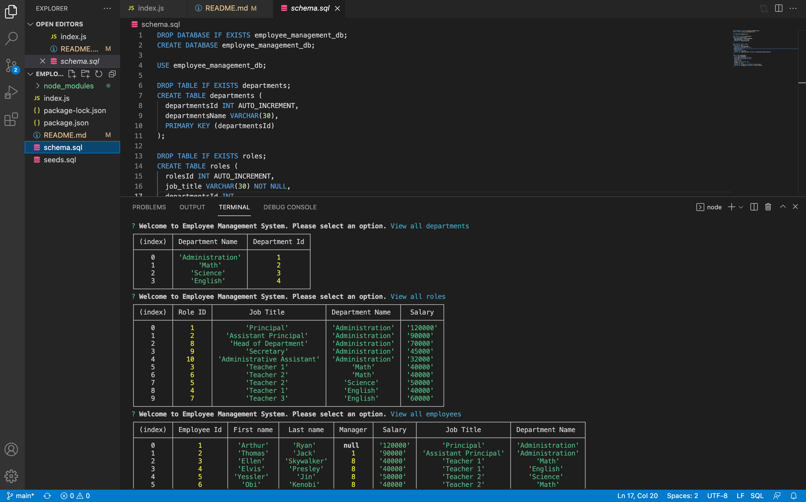

  

  # Employee_Management_System
  
  ## Description
  This application helps organize a teams information by creating a display easily accessible by members of the team. User can add departments, add roles, and add/ update employees. 
  
  ## Screenshot of application
   
  
  ## Table of Contents
  - [Installation](#installation)
  - [Usage](#usage)
  - [Contributing](#contributing)
  - [License](#license)
  - [Badges](#badges)
  - [Features](#features)
  - [Tests](#test)
  - [Questions](#questions)
 
  ## Installation
  - npm -i inquirer,  to install inquirer. 
  - mysql -u root -p, to set up mysql
  - source schema.sql, to set schema
  - source seeds.sql, to input base data
  - node index.js, to run the application.
  
  ## Contributing
  Feel free to add or change any code.

  
  ## License
  Community
  

  ## Features
  Inquirer, Node.js, Express.js
  
  ## Tests
  node run tests, to run tests.
 
  
  ## Questions
  If you have any questions feel free to contact me via email kevinc.php@gmail.com, Github kevin-cortina.
  
